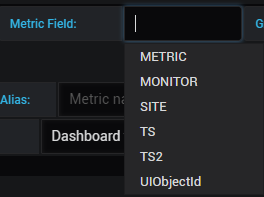
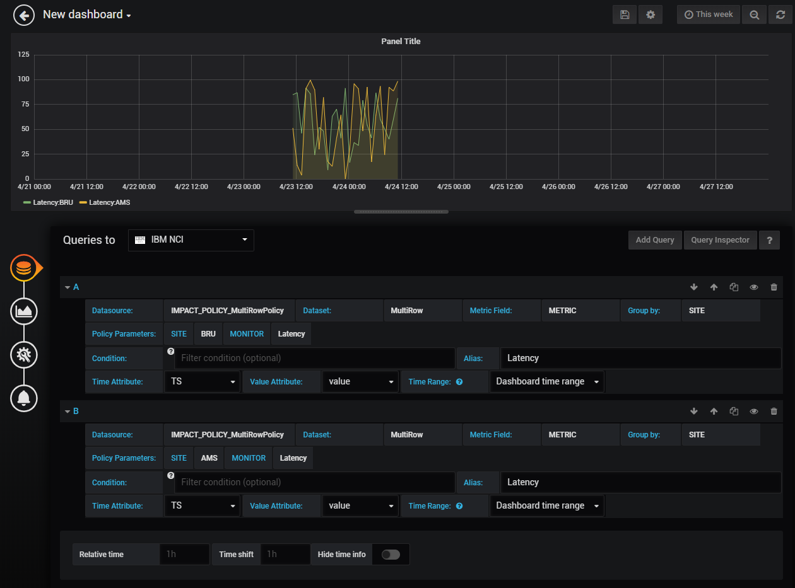

# IBM NCI plugin for Grafana

Author: Mario Schuerewegen

Contact: mario.schuerewegen@be.ibm.com

Revision: 0.1


**What's new:**

- 0.1
  - Initial Built   with support for Impact Objects and Array of Impact Objects DataTypes. 

Contents 
========

[**1. Introduction**](#introduction)

[**2  Example Impact Policy and output parameters**](#PolicyExample)

[**3  How to create a new panel using the IBM NCI datasource **](#Panel)

[**4. Grafana installation**](#grafana-installation)

[**5. IBM NCI plugin installation**](#ibm-nci-plugin-installation)

[**6. IBM NCI data source configuration**](#ibm-NCI-data-source-configuration)

[**7. Troubleshooting**](#troubleshooting)

Introduction
============

Grafana is an open source metric analytics and visualization suite. It is most commonly used for visualizing time series data for infrastructure and application analytics, but many use it in other domains including industrial sensors, home automation, weather, and process control.

Features: [*https://grafana.com/grafana*](https://grafana.com/grafana)

Basic Concepts
[*http://docs.grafana.org/guides/basic\_concepts/*](http://docs.grafana.org/guides/basic_concepts/)

Live Demo: [*http://play.grafana.org/*](http://play.grafana.org/)

Documentation: [*http://docs.grafana.org/*](http://docs.grafana.org/)

Plugins: *<https://grafana.com/plugins>* (or search for Grafana on GitHub)


IBM NCI plugin adds Grafana support for:

- IBM Netcool Impact 7.x

The plugin uses the Impact DataUI provider's REST API to collect data directly from Impact
and show on the Grafana dashboard.


Example Impact Policy and output parameters
===============================
Example Impact policies and param files is provided in the repository ../ImpactExamplePolicies/
MultiRowPolicy.ipl and MultiRowPolicy.params
SingleRowPolicy.ipl and SingleRowPolicy.params
upload them to the Impact server via the upload policy .ipl and .param file wizard.

The MultiRowPolicy provides a Array of Impact Objects data-set  with input parameter SITE and MONITOR
(you can type whatever you want,  the policy will generate some metric data for the last 24 Hours.)

The SingleRowPolicy provides a Impact Objects with NO input parameters.

but you can always force a input parameter using the grafana Condition field. This will be send to Impact as a single field with the entered key=value pairs.

How to create a new panel using the IBM NCI datasource
===============================

Follow these steps to create a sample chart the data from the MultiRowPolicy example


1.  Grafana logo -&gt; Dashboards -&gt; New.
2.  Drag and drop the Graph icon to the Empty Space.
3.  Now it should look like below.


4.  Click on the **Panel Title** bar and select **Edit**.


5.  change the time selector to > 24 h.  e.g. This Week


6.  Click the **Data source** list and select the NCI data source. In this example it is named *IBM NCI*.

7.  Select **DataSource** 
	(you can type the policyname name to search for impact policies with a dataUI output policy or scroll down a dropdown list).
    The list is built dynamically through the REST API call.
     If the resulting list is empty, a possible cause might be a connection problem with the NCI REST API.
     You can easily debug it with developer tools in Chrome or Firebug in Firefox (see the Troubleshooting chapter at the end of this document).

8.  Select DataSet.

    this will trigger a reload of the Time Attribute and Value Attribute Fields.
    The Policy Parameter will be also be completed with the input parametes of the policy, If any have been defined.

9.  Select Time Attribute and Value Attribute.
    ( keep in mind that an Impact _**DataTime**_ field provides **human readable time** in **displayvalue**.
    and the **epoch time** in **value**)
     **epoch/unix time** value is required for grafana metric series timestamps.
      
10.  Select Metric Field
    choose the field that provides the number ( metric ) that is going to in your graph.
    this can take a few seconds to populate from the REST information

11. Group by  Field
	( optional field..for data grouping in the graph)
	see graphs below.
12. Policy Parameters
	if any Policy Input Parameters exist in the policy, they will be visible in the Policy Parameter as input field.
    they are automatically populated with the name of the variable itselve in white.
    click the input field with the white text.

13.  Condition
	(for filtering results) and Alias (for parameter name customization) are optional.
	Alias, if defined will replace the default parameter name in the legend.
	The default is *MetricFieldName:GroupBy*.
    The alias replaces the *Metric Field Fieldname* in the graph legend.
   
15.  The result should be similar to the one below.

16.  In this example we want to draw data from two parameter on the
    same line chart. Click **+Add query**, to add a query from another params
    and select the Field the same way as above. The result should be similar
    to the one below.


17.  We are almost done! Add a proper chart title in General tab.

19.  Customize the legend in the Visualisation -> Legend tab to make it look better and
    provide more useful information. Much more can be customized in the
    Display tab.
If you want to customize each data series separately, use the Visualisation -> Series overrides section.

20.  The chart is completed. You can resize it if you want to include more
    panels in the row, add new rows with the new panels and so on.


Grafana installation
====================

Follow the steps described in the Grafana documentation:
[*http://docs.grafana.org/installation/*](http://docs.grafana.org/installation/) to install Grafana.


IBM NCI plugin installation
===========================
Latest verion of the plugin is always available on this GitHub page. It can be also installed from the Grafana plugin repository. If you upgrade from older plugin version, manually remove plugin directory, for example `/var/lib/grafana/plugins/grafana-ibm-NCI` or `/var/lib/grafana/plugins/ibm-NCI-datasource` and follow the installation steps below.

1).  Install the plugin using one of the following methods:

a.) Download the latest release of the IBM NCI plugin from [here](https://github.com/MarioSchuerewegen/grafana-ibm-nci/releases) and unpack on your Grafana server in `/var/lib/grafana/plugins` directory.

b.) Simply clone the GitHub repository on your Grafana server: 

```
cd /var/lib/grafana/plugins/
git clone https://github.com/MarioSchuerewegen/grafana-ibm-nci

```
c.) Install the plugin using the Grafana CLI:

```
grafana-cli plugins install ibm-NCI-datasource
```

3). Restart Grafana. On RedHat/Centos run:

`systemctl restart grafana-server`

IBM NCI data source configuration
=================================

Click the Grafana Logo -&gt; Data Sources and click **+Add data source**.


Specify the data source name and select “IBM NCI� from the list.


Specify the REST API URL:

`http://<NCI_server_hostname>:16311/ibm/tivoli/rest/providers/Impact_NCICLUSTER


 


Select **Basic Auth** and **With credentials** and specify the user name

-   impactadmin  (default password impactadmin)


Select checkbox "Deallocate dataset after every metric query". It is recommended to have it enabled all the time. Lack of datasource deallocation requests may cause memory leak and OutOfMemory exceptions on NCI .
Disable this option only for testing a new panel query, if you want to use Grafana Query Inspector feature.

The Screen below illustrates the completed configuration for the NCI data source:

{

Click **Save & Test**. If the connection is successful, you should see the following
message:


Click Cancel to exit. Now the data source is configured.


Troubleshooting
===============

This datasource only has support for "Impact Objects" and "Array of Impact Objects"  datatypes.
these are converted into single row(series) or multi row(series) data sets.
